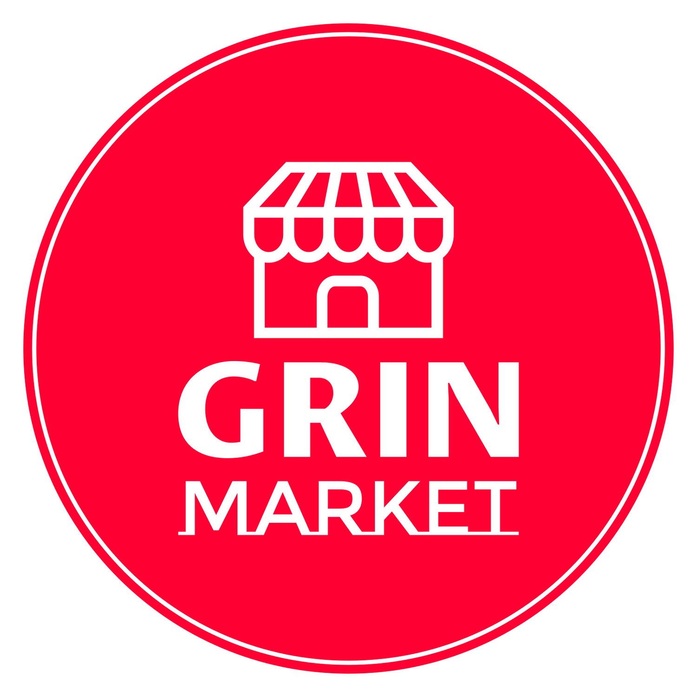

<div align="center">
    <br />
    <div>
      
    </div>
    <a display="block" href="hhttps://girn-market.vercel.app/" >
      https://girn-market.vercel.app/
    </a>
    <br />
</div>

## Content

- 🛠 [Built with](#built-with)
- 🚀 [Project](#project)
- 📖 [Pages](#pages)
- ✓ [Features](#features)
- 🔥 [Code](#code)
- 👍 [느낀점](#느낀점)

---

## Built with

### Front-end

- `Next JS`
- `Typescript`
- `tailwindCSS`
- `Framer-motion`
- `swr`
- `React-hook-form`

### Back-end

- `Next JS`
- `Prisma`
- `Planet Scale`
- `Vercel`
- `CloudFlare`

### Deploy

- `Vercel`

## Project

→ 업로드된 상품을 구매(페이크)하거나 찜목록에 추가 혹은 상품을 판매(페이크)할 수 있으며,  
 커뮤니티를 통해 서로 다른 사람과 코멘트를 남겨 이야기할 수 있습니다.

✓ 모든 `이미지는 CloudFlare`에 저장됩니다.

✓ 모델

<div>
   
</div>

<br /><br />

> 네비게이션

- 로그아웃 또는 로그인(로그인 여부), 아바타가 있습니다.
- 아바타를 통해 유저 프로필을 확인할 수 있고 로그인 유저라면, 로그아웃을 할 수 있습니다.
- 업로드와 Product(home), Community페이지를 확인할 수 있습니다.

> 1. 로그인

- 간편하게 유저네임과 이메일을 입력하고, 메일(SendGrid)로 토큰을 받고 검증하여 로그인 합니다.  
  (본 프로젝트는 배포시 메일을 통한 토큰 검증은 생략했습니다.)  
  → 토큰은 유저가 로그인하자마자 생성되고 입력하면 데이터베이스에서 삭제됩니다.
- `iron-session`의 `withSessionAPI`를 통해 유저를 인증하여 로그인됩니다.  
  → 데이터를 암호화된 쿠키에 저장됩니다.  
  → 쿠키(암호화)에 저장된 세션데이터는 서버측에서만 복호화할 수 있습니다.

  <br /><br />
  

> 2.  Product (Home)

- "home"페이지에서 업로드된 상품을 클릭하여 상세정보를 확인할 수 있습니다.
- "좋아요"를 할 수 있습니다.  
  → swr의 "mutate"api를 활용하여 캐시데이터를 직접 수정
- "좋아요"를 한 상품은 프로필 페이지 "Like"탭에서 확인할 수 있습니다.

```typescript
const { data, error, mutate } = useSWR<ProductDetailResponse>(
  router.query.id && `/api/products/${router.query.id}`
);

const [fav, { data: favData, loading: favLoading }] = useMutation(
  `/api/products/${router?.query?.id}/fav`
);
const onFav = () => {
  if (favLoading) return;
  mutate((data) => data && { ...data, isLiked: !data.isLiked }, false);
  fav({});
};
```

<br /><br />


> 3. 검색

- 상품 이름(제목)으로 검색할 수 있습니다.
- 관련 상품들을 확인할 수 있습니다.

  <br /><br />

> 4. 업로드

- 상품 이름(제목), 가격, 설명, 이미지를 입력하여 업로드 할 수 있습니다.
- 이미지는 미리보기를 통해 업로드할 수 있습니다.  
  → `React-hook-form`의 `watch`api를 이용하여 미리보기 후 사진도 업로드 할 수 있습니다.

<br /><br />


<br /><br />

> 5. About Product (상세정보)

- 이미지에 마우스를 hover하여 상세정보를 확인할 수 있습니다.
- "좋아요"와 "구매", "찜목록"를 클릭하여 확인할 수 있습니다.
  → `swr`의 `mutate`api를 통해 캐시를 조작하여 즉각적인 반응을 볼 수 있습니다.
- 로그인 여부를 체크하여 "리뷰"를 작성할 수 있습니다.

  <br /><br />
  

> 6. Edit Product (상품 수정)

- 상품 수정은 프로필 유자가 게시한 "Product"탭에서 확인할 수 있습니다.
- 제목(이름), 가격, 설명, 이미지를 변경할 수 있습니다.
- 상품을 삭제할 수 있습니다.

  <br /><br />
  

  > 7. Communication (게시글)

- 게시글을 업로드할 수 있습니다.
- "좋아요"를 할 수 있습니다.
- 게시글을 클릭하여 상세정보를 볼 수 있으며 "댓글"을 올릴 수 있습니다.
- 해당 유저가 올린 해당 유저의 댓글을 삭제할 수 있습니다.

<br /><br />


<br /><br />

> 8. Edit post (게시글 수정)

- 자신이 게시한 게시글(post)는 수정페이지로 이동할 수 있습니다.
- 게시글과, 이미지를 업데이트할 수 있습니다.
- 게시글을 삭제할 수 있습니다.

  <br /><br />
  

> 9. 프로필

- 유저가 게시한 상품, 게시글과 유저에 대한 정보를 확인할 수 있습니다.
- "좋아요", "찜목록", "구매목록"(페이크), "판매목록"(페이크)은 로그인한 해당 유저만 확인할 수 있습니다.
- 해당 유저는 프로필 수정페이지로 이동할 수 있습니다.
- `Dynamic imports`를 사용하여 소스를 필요할 때 로드하였습니다.

  <br /><br />

> 10. 프로필 수정

- 아바타 미리보기를 통해 이미지를 업데이트할 수 있습니다.
- 유저네임, 이메일 등 유저의 정보를 변경할 수 있습니다.
- 유저네임, 이메일은 유니크하기때문에 중복을 체크하여 업로드 할 수 있습니다.
- 계정을 삭제할 수 있습니다.

  <br /><br />
  

>

## Pages

- 로그인

> 홈

- 상품 목록 및 커뮤니케이션
- 검색
- 업로드

> product

- 상세페이지
- 상품 수정
- 리뷰작성

> communication

- 게시글 작성
- 댓글 작성

> User

- 프로필
- 프로필 수정

<br /><br />

## Features

### 🌈 Shop

- Info
- 리뷰작성
- 좋아요, 찜목록 추가
- 구매(페이크) - 구매목록
- 샵 수정 (포토 미리보기, 삭제)
  <br />

### 💻 Community

- 게시글 업로드
- 게시글 삭제 및 수정
- 게시글에 대한 댓글 작성 및 삭제
  <br />

### 🙋‍♂️ User

- 로그인
- 아바타 업로드 (포토 미리보기)
- 프로필 수정 (포토 미리보기, 삭제)
- 회원정보 변경
- 찜목록, 업로드상품, 구매목록(페이크), 판매목록(페이크) 확인
  <br />

## Code

<a href="https://github.com/jangth0655/nextjs-girnmarket">🔥 GitHub</a>

<br /><br />

## 느낀점

- 모델간의 관계를 설정하고 Prisma와 PlanetScale을 연결하고 데이터를 가져오고 쿼리하는 것을 익히고 이해할 수 있는 계기가 되었습니다.
- 라우터 설정없이 `pages`에 내에서 경로를 설정을 익숙해질 수 있었고, `api`를 핸들러를 이용하여 직접 만들 수 있다는 점에서 흥미로웠다.
- CSR과 SSR그리고 SSG에 대해 좀 더 이해할 수 있게 되었다.
- ISR을 위해 `getStaticProps`와 `getStaticPaths` 그리고 `revalidate`을 사용해 보면서  
  정적소스(HTML)를 미리 생성하고 또한 업데이트시 다시 빌드할 필요없이 정적소스를 즉각 만들어준다는 점에서 흥미로웠고, 앱의 속도가 좀 더 빨라지는 것을 배울 수 있었다.
- Next.js의 `Dynamic imports`를 사용하여 필요한 소스만 로드하는 것을 배울 수있었다.
- Next.js의 `Image`와 `CloudFlare`를 이용하여 최적화하는 것을 배울 수 있었다.
- `swr` 라이브러리를 활용하여 데이터를 패치하여 케시된 데이터를 조작하고 즉각적인 반응을 보여줄 수 있어 `swr`에 대해 좀 더 배울 수 있었다.
- 하지만 모델 관계를 이해하고 설정하는데 있어서 어려운 부분이 있었고,
- Next.js의 구조와 ISR을 사용하는데 있어서 연습이 필요하다고 느꼈다.
